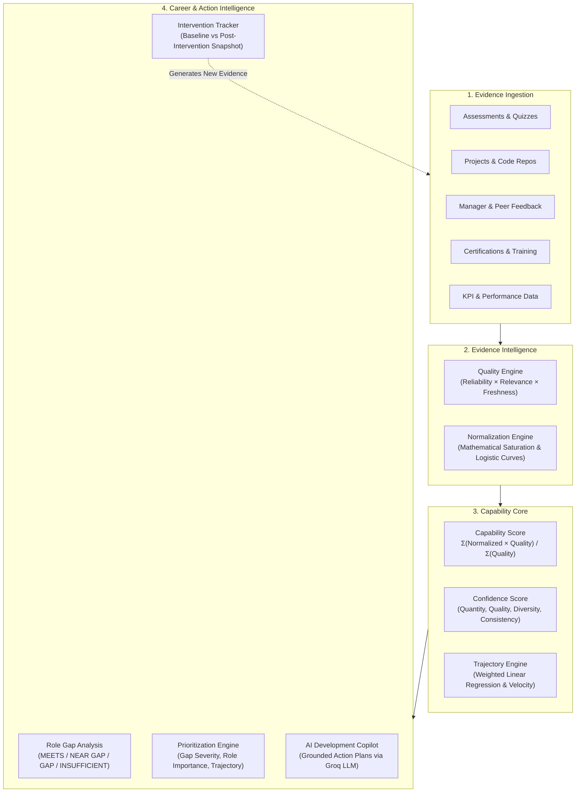
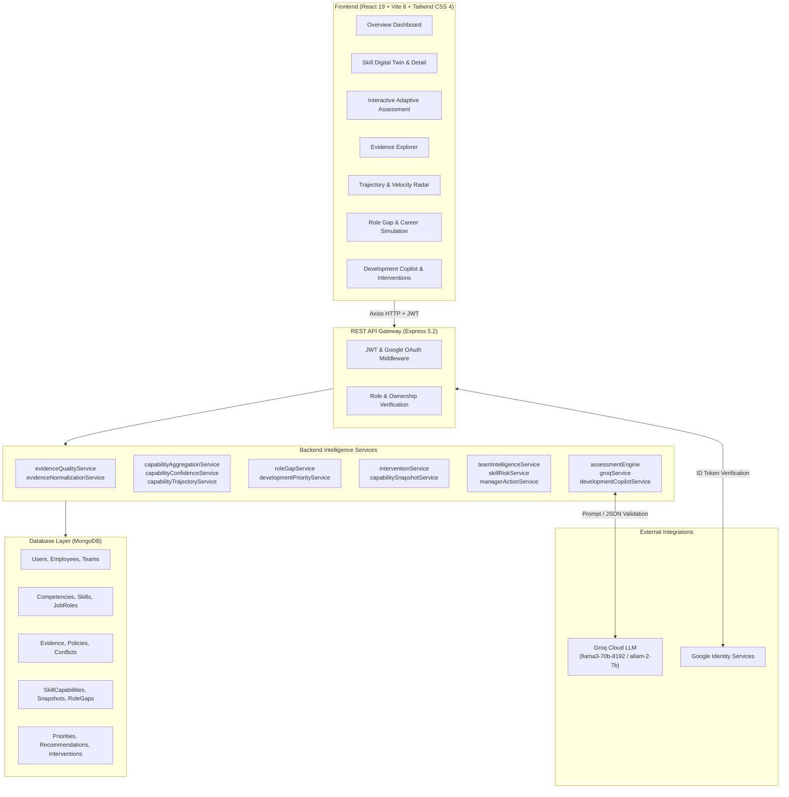
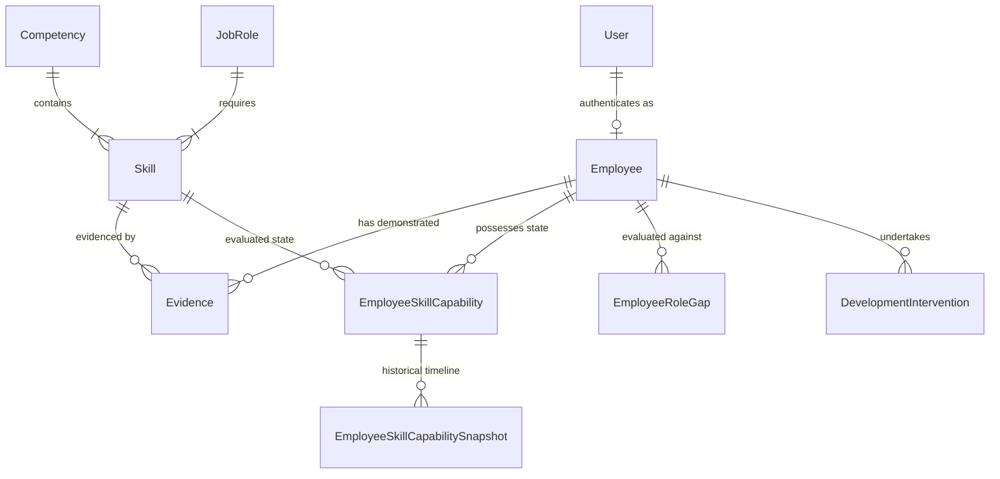

# TalentTwin

> **Continuous Talent Intelligence & Skill Growth Platform**

TalentTwin transforms fragmented employee activity into a continuously evolving, evidence-backed representation of what employees can do, how confidently we know it, and how their capabilities are changing over time.

---

## Overview

Traditional human resource management and skill tracking systems rely on static point-in-time snapshots: annual performance appraisals, self-reported resume skills, or one-off test scores. These snapshots are quickly outdated, vulnerable to subjective bias, and divorced from daily work. Most critically, they fail to answer fundamental operational questions: *What evidence supports this skill rating? How recent is that evidence? Is the skill improving, plateauing, or atrophying? And what specific, verified step should the employee take next?*

TalentTwin solves this problem by introducing the **Employee Skill Digital Twin**—a living, evidence-grounded intelligence layer that synthesizes multi-source organizational signals into real-time capability evaluations. Rather than reducing human competency to a raw commit tally, course completion certificate, or manager checkbox, TalentTwin ingests heterogeneous observations, evaluates their credibility, normalizes them onto a shared mathematical scale, calculates statistical confidence, and tracks longitudinal growth velocity.

Built as an end-to-end full-stack platform, TalentTwin bridges the gap between individual career development and organizational workforce planning. Employees receive explainable skill profiles, targeted role-gap analyses, and AI-grounded development plans with closed-loop intervention tracking. Organizations gain verifiable visibility into team capabilities, skill concentration risks, and proactive talent mobility pathways.

---

## The Problem

### Static Snapshots vs. Continuous Capability Intelligence

| Traditional Talent Management | TalentTwin Continuous Intelligence |
|:------------------------------|:-----------------------------------|
| **Annual Static Review**: Point-in-time evaluation that decays immediately after completion. | **Continuous Streaming Evidence**: Capability dynamically updates whenever new verifiable observations occur. |
| **Self-Declared Claims**: Skills listed on static resumes or profiles with zero proof of mastery. | **Evidence-Backed Validation**: Every capability level is grounded in concrete, inspectable organizational artifacts. |
| **All Evidence Treated Equal**: A self-rating is often given equal weight to an architected system delivery. | **Quality & Freshness Weighted**: Evidence is weighted by source reliability, contextual relevance, and exponential time decay. |
| **Binary Knowledge (Yes / No)**: Assumes an employee either possesses a skill or does not. | **Proficiency + Confidence**: Quantifies both the estimated capability level (1–5) and the statistical sufficiency of the supporting evidence. |
| **Stateless Assessment**: Ignores whether a capability was demonstrated last week or three years ago. | **Longitudinal Trajectory**: Measures slope, velocity (score change per 30 days), and regression goodness-of-fit ($R^2$). |
| **Open-Loop Suggestions**: Recommends courses with no follow-up measurement of actual capability change. | **Closed-Loop Interventions**: Compares pre- and post-intervention snapshots to record observed capability shifts. |

---

## Our Solution: The Employee Skill Digital Twin

TalentTwin replaces the legacy model (`Employee → Job Title → Skills → Resume`) with a dynamic intelligence loop:

```
Employee
   │
   ▼
Continuous Multi-Source Evidence
   │
   ▼
Evidence Quality & Normalization Engine
   │
   ▼
Deterministic Capability State (1–5)
   │
   ▼
Confidence & Evidence Sufficiency Engine
   │
   ▼
Longitudinal Trajectory & Velocity Analysis
   │
   ▼
Role Gap & Readiness Engine
   │
   ▼
AI Development Copilot (Bounded & Grounded)
   │
   ▼
Targeted Development Intervention
   │
   ▼
New Verifiable Evidence Generation
   │
   └───► (Continuous Recalculation Loop)
```

---

## How TalentTwin Works



---

## Core Features

### Implemented & Fully Operational

| Feature Category | Capability | Status | Description |
|:---|:---|:---:|:---|
| **Employee Intelligence** | **Skill Digital Twin** | Verified | Living profile capturing capability scores, proficiency levels (1–5), confidence scores, and historical evidence counts. |
| | **Competency Hierarchy** | Verified | Two-tier hierarchy mapping concrete Skills under 8 core organizational Competencies with 5-level descriptive rubrics. |
| | **Competency Capability Rollup** | Verified | Deterministic aggregation of skill capabilities into weighted competency-level proficiency ratings. |
| **Evidence Intelligence** | **Multi-Source Ingestion** | Verified | Native schemas for assessments, projects, feedback, KPIs, GitHub activity, LeetCode, Coursera, certifications, and AI quizzes. |
| | **Source Reliability Policy** | Verified | Explicit origin trust weighting (e.g., Internal Assessment: 0.95, Certifications: 0.90, Manager Feedback: 0.85, Peer Feedback: 0.65). |
| | **Relevance & Freshness Decay** | Verified | Precision-based relevance scaling (1.0 for skill, 0.6 for broad competency) combined with continuous exponential decay (365-day half-life). |
| | **Mathematical Normalization** | Verified | Source-specific transforms: saturating rational functions ($x / (x+k)$) for GitHub/LeetCode, logistic curves for ratings, linear mappings for feedback. |
| | **Conflict & Variance Detection** | Verified | Evaluates signal spread, weighted variance, and polarity divergence between positive and negative evidence. |
| | **Evidence Explainability** | Verified | Plain-language transparency engine detailing exactly which observations, source families, and weights produced a capability estimate. |
| **Continuous Intelligence** | **Capability Aggregation** | Verified | Weighted-mean calculation excluding ungrounded or non-quantitative inputs without defaulting missing data to zero. |
| | **Confidence & Sufficiency** | Verified | Composite metric balancing evidence volume ($n/(n+3)$), source quality, source diversity across 8 families, and observation variance. |
| | **Longitudinal Trajectory** | Verified | Weighted linear regression over chronological timestamps to determine direction (`IMPROVING`, `STABLE`, `DECLINING`, `INSUFFICIENT_DATA`). |
| | **Growth Velocity** | Verified | Normalized capability change per 30-day window ($slope \times 30$) paired with regression goodness-of-fit ($R^2$) and confidence metrics. |
| **Career & Development** | **Role Gap Analysis** | Verified | Evaluates capability against role requirements, classifying each skill as `MEETS`, `NEAR_GAP`, `GAP`, or `INSUFFICIENT_EVIDENCE`. |
| | **Deterministic Prioritization** | Verified | Ranks skill gaps based on gap severity (30%), role importance (25%), confidence (20%), trajectory (15%), and sufficiency (10%). |
| | **AI Development Copilot** | Verified | LLM-generated personal development roadmaps strictly bounded by immutable backend facts, rubrics, and gap priorities. |
| | **Intervention Tracking** | Verified | Pre-intervention baseline snapshots and post-intervention outcome evaluations measuring observed state changes without false causal claims. |
| | **Career Path Simulation** | Verified | Simulated role transitions comparing employee readiness across target job profiles and identifying critical prerequisite skills. |
| **Adaptive Assessments** | **Dynamic Question Generation** | Verified | Groq-powered scenario question generator tailored to specific target proficiency levels (1–5) and historical candidate weaknesses. |
| | **Multidimensional Evaluation** | Verified | Evaluates free-text answers across 4–6 skill dimensions with score extraction, depth, correctness, strengths, and weaknesses. |
| | **Adaptive Difficulty Engine** | Verified | Dynamically adjusts subsequent question difficulty and determines stopping points based on estimate convergence. |
| **Org & Team Intelligence** | **Team Capability Rollup** | Verified | Aggregates team-level capability distributions, identifying average proficiencies and trajectory balances. |
| | **Skill Concentration Risk** | Verified | Calculates skill shortage risks and concentration scores based on employee coverage and advanced proficiency counts. |
| | **Department & Org Overviews** | Verified | Cross-departmental distribution analysis tracking trajectory percentages across the workforce. |
| | **Manager Action Center** | Verified | Automated generation of manager alerts for critical organizational skill shortages and high-priority development gaps. |

---

## Intelligence Pipeline

The TalentTwin core operates across 9 deterministic and verifiable stages:

```
1. Evidence ➔ 2. Quality ➔ 3. Normalization ➔ 4. Capability ➔ 5. Confidence ➔ 6. Trajectory ➔ 7. Role Gap ➔ 8. Development ➔ 9. New Evidence ↺
```

1. **Evidence Ingestion**: Structured records enter the system through assessments, project deliverables, feedback entries, or integrations.
2. **Quality Scoring**: The system computes:
   $$\text{Quality} = \text{Reliability} \times \text{Relevance} \times \text{Freshness}$$
   where freshness is governed by continuous exponential decay with a 365-day half-life: $\text{Freshness} = e^{-\lambda \cdot t_{\text{days}}}$, $\lambda = \frac{\ln(2)}{365}$.
3. **Evidence Normalization**: Raw measurements are mapped onto a uniform $[0, 1]$ interval using domain-appropriate functions (e.g., saturating rational functions for activity metrics, linear transforms for ratings).
4. **Capability Estimation**: Computes the quality-weighted mean of eligible observations:
   $$\text{Capability Score} = \frac{\sum (\text{Normalized Value}_i \times \text{Quality}_i)}{\sum \text{Quality}_i}$$
   If no eligible evidence exists, the capability score remains `null`—preventing unobserved skills from being penalized as failures.
5. **Confidence & Sufficiency**: Measures how strongly the available data supports the capability estimate through a weighted formula:
   $$\text{Confidence} = 0.30 \times \text{Quantity} + 0.25 \times \text{Quality} + 0.20 \times \text{Diversity} + 0.25 \times \text{Consistency}$$
   Categorizes sufficiency into `INSUFFICIENT` ($n=0$), `LIMITED` ($n=1$), `MODERATE` ($n=2\text{--}3$), or `STRONG` ($n \ge 4$).
6. **Trajectory & Velocity**: Runs a weighted linear regression over historical observations ($n \ge 3$) to derive slope, velocity ($\Delta \text{score} / 30\text{ days}$), and $R^2$. Classifies skill movement into `IMPROVING`, `STABLE`, or `DECLINING`.
7. **Role Gap Analysis**: Matches current proficiency against target JobRole expectations, categorizing requirements as `MEETS` ($\text{gap} \le 0$), `NEAR_GAP` ($\text{gap} = 1$), `GAP` ($\text{gap} \ge 2$), or `INSUFFICIENT_EVIDENCE`.
8. **Development Planning**: The system deterministically ranks confirmed gaps into prioritized development targets and invokes the AI Development Copilot to craft structured action plans.
9. **Intervention & New Evidence**: Interventions capture pre- and post-snapshots. Subsequent project work or assessments produce new evidence records, initiating the recalculation loop.

---

## Evidence Philosophy

TalentTwin adheres to core epistemological principles to guarantee fairness and reliability:

- **Evidence Over Declarations**: Self-reported skill lists and unverified profile claims are non-evaluative (`normalizedValue = null`). Capability requires demonstrable, observed behavior.
- **Activity $\neq$ Mastery**: 100 GitHub commits or 50 completed pull requests demonstrate activity and familiarity, but not necessarily advanced software architecture. Saturating rational curves prevent raw volume from artificially inflating capability to expert levels.
- **Course Completion $\neq$ Competency**: Finishing a video module proves consumption, not capability. Training without graded assessments carries lower source reliability and bounded normalization.
- **Recency Matters**: Skills atrophy when unused. Exponential freshness decay naturally reduces the contribution of aging observations without prematurely wiping out historical context.
- **Missing Evidence $\neq$ Zero Capability**: Unknown capability is represented strictly as `null` / `INSUFFICIENT_EVIDENCE`. TalentTwin never scores an unobserved skill as Level 0 or a failure.
- **Deterministic Core + Bounded AI**: AI models never calculate core capability scores, assign priority weights, or modify role requirements. AI is utilized strictly for generative tasks (drafting questions, evaluating descriptive answers, generating recommendations) bounded by authoritative backend facts.

---

## Capability Model

TalentTwin uses a standardized 5-level proficiency framework mapped to normalized score intervals:

| Level | Designation | Score Range | Operational Rubric Definition |
|:---:|:---|:---:|:---|
| **1** | **Foundational** | $0.00 - 0.19$ | Understands basic terminology, fundamental principles, and requires continuous guidance to execute tasks. |
| **2** | **Developing** | $0.20 - 0.39$ | Possesses working knowledge; executes standard tasks independently with occasional oversight on edge cases. |
| **3** | **Proficient** | $0.40 - 0.59$ | Demonstrates solid practical experience, delivers clean and reliable output, and handles complex situations smoothly. |
| **4** | **Advanced** | $0.60 - 0.79$ | Deep specialized mastery; guides and mentors others, establishes technical or domain standards, and solves ambiguous challenges. |
| **5** | **Expert** | $0.80 - 1.00$ | Industry-leading authority; designs strategic architectures, drives paradigm shifts, and invents novel organizational solutions. |

### Core Competency Framework
Every skill in TalentTwin is mapped underneath one of 8 foundational competency domains:
1. **Technical Expertise** (Engineering, System Design, Languages, Infrastructure)
2. **Problem Solving** (Algorithmic reasoning, Debugging, Root Cause Analysis)
3. **Communication** (Technical articulation, Cross-functional alignment, Documentation)
4. **Leadership** (Mentorship, Strategic vision, Initiative)
5. **Collaboration** (Team synergy, Code review empathy, Cross-team alignment)
6. **Data & Analytical Thinking** (Quantitative reasoning, Metric interpretation)
7. **Adaptability** (Technological agility, Resilience, Rapid context switching)
8. **Execution & Ownership** (Delivery accountability, Operational excellence)

---

## Trajectory Model

To track whether an employee's capabilities are growing, stagnating, or decaying, TalentTwin runs **Weighted Linear Regression** across chronological evidence points:

- **Minimum Threshold**: Requires at least 3 active, quantitative observations across distinct points in time.
- **Slope ($m$)**: Represents capability change per day.
- **Velocity**: Extrapolates slope over a standard business period:
  $$\text{Velocity} = m \times 30\text{ days}$$
- **Trajectory Classification**:
  - `IMPROVING`: $\text{Velocity} > +0.01$ (statistically positive rate of growth)
  - `STABLE`: $-0.01 \le \text{Velocity} \le +0.01$ (steady capability retention)
  - `DECLINING`: $\text{Velocity} < -0.01$ (observed drop in performance or high-variance degradation)
  - `INSUFFICIENT_DATA`: Fewer than 3 valid data points available.
- **Goodness-of-Fit ($R^2$) & Confidence**: Calculates the coefficient of determination to differentiate steady trends from sporadic volatility.

---

## Role Gap Analysis

TalentTwin assesses employee capability against the explicit skill and competency requirements of target `JobRole` profiles:

$$\text{Skill Gap} = \text{Required Level} - \text{Current Proficiency Level}$$

```
Role: Senior Full-Stack Engineer

Skill: System Design
├── Required Level:  4 (Advanced)
├── Current Level:   3 (Proficient)
└── Status:          NEAR GAP (Gap = 1) ➔ Address via Targeted Development

Skill: API Development
├── Required Level:  4 (Advanced)
├── Current Level:   4 (Advanced)
└── Status:          MEETS (Gap = 0) ➔ Maintained

Skill: Cloud Security
├── Required Level:  3 (Proficient)
├── Current Level:   1 (Foundational)
└── Status:          GAP (Gap = 2) ➔ High-Priority Intervention

Skill: Distributed Caching
├── Required Level:  3 (Proficient)
├── Current Level:   Unknown (No quantitative data)
└── Status:          INSUFFICIENT EVIDENCE ➔ Trigger Diagnostic Assessment
```

> **Strict Rule**: When an employee lacks evidence for a skill, TalentTwin marks the status as `INSUFFICIENT_EVIDENCE` and keeps the gap undefined. The platform never treats an unobserved skill as Level 0.

---

## AI Architecture

TalentTwin adopts a strict dual-layer architectural pattern:

```
┌─────────────────────────────────────────────────────────┐
│               AI INTELLIGENCE LAYER (Groq LLM)          │
│  - Adaptive scenario question generation               │
│  - Multi-dimensional rubric evaluation of answers       │
│  - Natural-language capability explanations             │
│  - Grounded personalized development action copilot     │
│  - Contextual talent advisory chat                      │
└────────────────────────────┬────────────────────────────┘
                             │ Strictly Bounded Prompts &
                             │ Hard JSON Schemas
┌────────────────────────────▼────────────────────────────┐
│          DETERMINISTIC INTELLIGENCE CORE (Backend)      │
│  - Mathematical evidence normalization                  │
│  - Source reliability & exponential decay engine        │
│  - Quality-weighted capability score calculation        │
│  - Multi-factor confidence & sufficiency scoring        │
│  - Weighted linear regression trajectory & velocity     │
│  - Deterministic gap ranking & snapshot comparisons     │
└─────────────────────────────────────────────────────────┘
```

The AI layer cannot invent capability scores, overwrite gap severities, or modify employee master records. All recommendations and evaluations are validated against strict JSON schemas before being persisted.

---

## System Architecture



---

## Repository Structure

```
pccoeHack/
├── README.md                           # Main GitHub repository documentation
├── backend/                            # Node.js + Express backend service
│   ├── .env.example                    # Backend environment configuration template
│   ├── package.json                    # Backend dependencies and scripts
│   ├── scripts/                        # Database seeders, E2E tests, and utility scripts
│   │   ├── synthetic-seed.js           # Full synthetic dataset generator with scenarios
│   │   ├── seed.js                     # Base competencies, skills, and role seed data
│   │   ├── testE2ELoop.js              # Complete end-to-end intelligence loop verification
│   │   ├── testCapabilityAggregation.js # Unit tests for capability calculation
│   │   ├── testCapabilityConfidence.js  # Tests for confidence & sufficiency
│   │   ├── testCapabilityTrajectory.js  # Tests for linear regression & velocity
│   │   ├── testRoleGap.js               # Tests for role gap classification
│   │   ├── testDevelopmentCopilot.js   # Tests for AI copilot grounding
│   │   └── testIntervention.js         # Tests for intervention snapshot & impact
│   └── src/
│       ├── app.js                      # Express application assembly & route mounting
│       ├── server.js                   # Server initialization & DB connection listener
│       ├── config/                     # Database connection configuration (Mongoose)
│       ├── controllers/                # 24 REST controllers orchestrating request flow
│       ├── middleware/                 # JWT authentication, role-based access, and error handlers
│       ├── models/                     # 19 Mongoose schemas defining talent intelligence
│       ├── routes/                     # Express route modules for all API domains
│       ├── services/                   # 25 core intelligence services implementing the math & AI
│       └── utils/                      # JWT generation and helper utilities
└── frontend/                           # React 19 + Vite frontend application
    ├── index.html                      # HTML5 root entry with modern styling
    ├── package.json                    # Frontend dependencies and build scripts
    ├── vite.config.js                  # Vite bundler configuration
    ├── public/                         # Public SVG icons and brand assets
    └── src/
        ├── App.jsx                     # Root router with protected dashboard routes
        ├── main.jsx                    # Application mount point with GoogleOAuthProvider
        ├── index.css                   # Global Tailwind CSS 4 directives
        ├── api.js                      # Axios instance configured with JWT auth interceptors
        ├── components/                 # Reusable UI component library
        │   ├── auth/                   # Authentication forms and ProtectedRoute wrapper
        │   ├── dashboard/              # Shared dashboard cards, headers, and stat widgets
        │   └── landing/                # Public landing page sections (Hero, Pipeline, Features)
        ├── context/                    # React Context providers (AuthContext)
        ├── layouts/                    # Application shell with responsive sidebar & navbar
        └── pages/                      # Page views
            ├── LandingPage.jsx         # Marketing & architecture overview
            ├── Login.jsx & Signup.jsx  # Authentication views with Google OAuth
            └── dashboard/              # Protected intelligence views
                ├── Overview.jsx        # Executive capability & growth summary
                ├── SkillsList.jsx      # Interactive skill directory with competency filters
                ├── SkillDetail.jsx     # Deep dive: evidence, live adaptive assessment, explanation
                ├── Evidence.jsx        # Evidence Explorer & multi-source manual ingestion
                ├── Trajectory.jsx      # Longitudinal progression & velocity radar
                ├── Career.jsx          # Role Gap Analysis & Target Role simulation
                ├── Development.jsx     # AI Copilot action plan & intervention tracker
                └── Settings.jsx        # Account management & identity linking
```

---

## Installation & Setup

### Prerequisites
- **Node.js**: v18.0.0 or higher
- **npm**: v9.0.0 or higher
- **MongoDB**: Local instance running on port 27017 or a MongoDB Atlas connection string
- **Groq API Key**: Obtainable from [console.groq.com](https://console.groq.com/) for AI features

---

### 1. Clone the Repository
```bash
git clone https://github.com/pallavdeshmukh18/pccoeHack.git
cd pccoeHack
```

---

### 2. Backend Setup
```bash
# Navigate to the backend directory
cd backend

# Install dependencies
npm install

# Create environment configuration
cp .env.example .env
```

Configure your `.env` file with appropriate values (see [Environment Variables](#environment-variables)).

```bash
# Seed the database with competencies, skills, job roles, and synthetic evidence
npm run seed

# Run the full end-to-end intelligence loop test
npm test

# Start the development server (runs nodemon on port 5000 by default)
npm run dev
```

The backend API will start at: `http://localhost:5000`

---

### 3. Frontend Setup
```bash
# Open a new terminal and navigate to the frontend directory
cd frontend

# Install dependencies
npm install

# Start the Vite development server
npm run dev
```

The frontend application will be accessible at: `http://localhost:5173`

---

## Environment Variables

### Backend Configuration (`backend/.env`)

| Variable | Description | Required | Default / Example |
|:---|:---|:---:|:---|
| `PORT` | Port for the Express server to listen on | Optional | `5000` |
| `MONGO_URI` | MongoDB connection URI string | **Yes** | `mongodb://127.0.0.1:27017/talenttwin` |
| `JWT_SECRET` | Secret key used to sign and verify authentication JWTs | **Yes** | `your_super_secret_jwt_key` |
| `JWT_EXPIRES_IN` | Token expiration duration | Optional | `7d` |
| `GROQ_API_KEY` | API Key for Groq Cloud LLM inference | **Yes** | `gsk_...` |
| `GROQ_MODEL` | Groq LLM model identifier | Optional | `llama3-70b-8192` (or `allam-2-7b`) |
| `GOOGLE_CLIENT_ID` | Google OAuth 2.0 Web Client ID | Optional | `your-client-id.apps.googleusercontent.com` |
| `GOOGLE_CLIENT_SECRET` | Google OAuth 2.0 Client Secret | Optional | `your-google-client-secret` |
| `GOOGLE_REDIRECT_URI` | Google OAuth callback URL | Optional | `http://localhost:5000/api/auth/google/callback` |

### Frontend Configuration (`frontend/.env`)

| Variable | Description | Required | Default / Example |
|:---|:---|:---:|:---|
| `VITE_API_URL` | Base URL pointing to the running backend API | Optional | `http://localhost:5000/api` |
| `VITE_GOOGLE_CLIENT_ID` | Public Google OAuth Client ID for the web frontend | Optional | `your-client-id.apps.googleusercontent.com` |

---

## API Overview

### Authentication & Users
| Method | Endpoint | Description | Access |
|:---|:---|:---|:---|
| `POST` | `/api/auth/signup` | Register a new user account | Public |
| `POST` | `/api/auth/login` | Authenticate with email/password and obtain JWT | Public |
| `POST` | `/api/auth/google` | Authenticate or register using a Google ID token | Public |
| `POST` | `/api/auth/google/link` | Link existing user account to Google identity | Authenticated |
| `GET` | `/api/auth/me` | Fetch currently authenticated user profile | Authenticated |

### Employees, Competencies, Skills & Roles
| Method | Endpoint | Description | Access |
|:---|:---|:---|:---|
| `GET` | `/api/employees` | List all employees | Admin |
| `GET` | `/api/employees/:id` | Fetch employee by ID | Owner / Admin |
| `GET` | `/api/competencies` | List all 8 core competencies and proficiency rubrics | Public |
| `GET` | `/api/skills` | List all registered skills with competency relations | Public |
| `GET` | `/api/skills/:id` | Fetch specific skill definition and rubrics | Public |
| `GET` | `/api/job-roles` | List all registered job roles and target requirements | Public |
| `GET` | `/api/job-roles/:id` | Fetch specific job role and required skill thresholds | Public |

### Evidence Management
| Method | Endpoint | Description | Access |
|:---|:---|:---|:---|
| `POST` | `/api/evidence` | Ingest new evidence record (triggers quality & normalization) | Authenticated |
| `GET` | `/api/evidence` | Query and filter active evidence records | Authenticated |
| `GET` | `/api/evidence/:id` | Fetch specific evidence record with quality breakdown | Authenticated |
| `PUT` | `/api/evidence/:id` | Update an existing evidence record | Authenticated |
| `DELETE` | `/api/evidence/:id` | Archive / revoke an evidence record | Authenticated |

### Capability, Confidence & Trajectory
| Method | Endpoint | Description | Access |
|:---|:---|:---|:---|
| `POST` | `/api/capabilities/recalculate` | Trigger full capability aggregation for employee + skill | Authenticated |
| `GET` | `/api/capabilities/employee/:employeeId` | Retrieve all current skill capability states for an employee | Owner / Admin |
| `GET` | `/api/capabilities/employee/:employeeId/skill/:skillId` | Retrieve specific skill state with confidence & trajectory | Owner / Admin |
| `GET` | `/api/competency-capabilities/employee/:employeeId` | Retrieve rolled-up competency capabilities | Owner / Admin |

### Career, Gaps, Development & Interventions
| Method | Endpoint | Description | Access |
|:---|:---|:---|:---|
| `POST` | `/api/role-gaps/recalculate` | Run role gap analysis for employee against target role | Owner / Admin |
| `GET` | `/api/role-gaps/employee/:employeeId/role/:jobRoleId` | Retrieve detailed role gap evaluation | Owner / Admin |
| `POST` | `/api/development-priorities/recalculate` | Calculate prioritized development gaps | Owner / Admin |
| `POST` | `/api/development-copilot/generate` | Generate grounded AI development plan via Groq | Owner / Admin |
| `GET` | `/api/development-copilot/employee/:employeeId/role/:jobRoleId` | Retrieve generated development plan | Owner / Admin |
| `POST` | `/api/interventions` | Create a targeted development intervention (captures baseline) | Owner / Admin |
| `GET` | `/api/interventions/employee/:employeeId` | List interventions and their progress for an employee | Owner / Admin |
| `POST` | `/api/interventions/:id/complete` | Complete intervention and evaluate observed impact delta | Owner / Admin |
| `POST` | `/api/career/simulate` | Simulate career progression towards a target job role | Owner / Admin |

### Adaptive Assessments & AI Intelligence
| Method | Endpoint | Description | Access |
|:---|:---|:---|:---|
| `POST` | `/api/assessments/start` | Initialize an adaptive diagnostic assessment session | Authenticated |
| `POST` | `/api/assessments/:id/answer` | Submit answer for evaluation and receive next question | Authenticated |
| `POST` | `/api/assessments/:id/complete` | Conclude assessment and compute final estimated proficiency | Authenticated |
| `GET` | `/api/explanations/employee/:employeeId/skill/:skillId` | Generate plain-language capability explanation | Owner / Admin |
| `POST` | `/api/evidence-conflicts/detect` | Scan for polarity and variance conflicts in evidence | Owner / Admin |
| `POST` | `/api/ai/chat` | Contextual Q&A bounded strictly by employee capability facts | Authenticated |

### Organization, Teams & Risks
| Method | Endpoint | Description | Access |
|:---|:---|:---|:---|
| `GET` | `/api/teams/:teamId/capabilities` | Aggregated team capability distribution and trajectories | Admin |
| `GET` | `/api/departments/:department/overview` | Department-level capability growth percentages | Admin |
| `GET` | `/api/organization/overview` | Global workforce capability and trajectory summary | Admin |
| `POST` | `/api/risks/evaluate` | Evaluate organization-wide skill concentration and risk | Admin |
| `GET` | `/api/manager-actions` | Fetch triage list of critical shortages and dev priorities | Admin |

---

## Database & Data Model

TalentTwin's data architecture is implemented using 19 Mongoose schemas:



### Key Entities
- **`User`**: Account authentication, bcrypt password hashes, assigned role (`ADMIN`, `EMPLOYEE`), and optional Google OAuth link.
- **`Employee`**: Master record containing employee code, contact details, department, current job title, manager reference, and team assignment.
- **`Competency` & `Skill`**: Two-tier capability graph. Each entity contains explicit 5-level rubrics with descriptive behavioral indicators.
- **`JobRole`**: Organizational benchmark defining required competencies and skills with minimum level thresholds and importance weights (`LOW`, `MEDIUM`, `HIGH`, `CRITICAL`).
- **`Evidence`**: Immutable log of observed behavior. Stores source metadata, raw observations, direction (`POSITIVE`, `NEGATIVE`, `NEUTRAL`), computed quality (`reliability * relevance * freshness`), and normalized values ($[0, 1]$).
- **`EmployeeSkillCapability`**: Current state representation. Persists calculated capability score, proficiency level (1–5), confidence metrics (quantity, quality, diversity, consistency), and trajectory indicators (slope, velocity, $R^2$).
- **`EmployeeRoleGap`**: Compares an employee's capabilities to a target role, categorizing each requirement as `MEETS`, `NEAR_GAP`, `GAP`, or `INSUFFICIENT_EVIDENCE`.
- **`DevelopmentRecommendation`**: AI Copilot output merging unchangeable backend gap facts with Groq-generated learning objectives, recommended actions, projects, and cautions.
- **`DevelopmentIntervention`**: Closed-loop tracking record. Stores a baseline capability snapshot before intervention and captures a post-intervention snapshot upon completion to record observed change.
- **`AssessmentSession`**: Dynamic diagnostic session tracking question difficulty, rubric evaluations, dimensional scores, and convergence metrics.

---

## Testing & Verification

TalentTwin features a comprehensive automated testing suite utilizing in-memory MongoDB (`mongodb-memory-server`) to ensure deterministic pipeline calculations:

```bash
cd backend
npm test
```

The primary end-to-end verification script (`backend/scripts/testE2ELoop.js`) validates the entire closed-loop lifecycle:
1. Ingests raw evidence records across multiple dates.
2. Computes evidence quality (with exponential decay) and mathematical normalization.
3. Aggregates capability scores and verifies confidence and sufficiency ratings.
4. Detects potential evidence conflicts and high variance.
5. Generates human-readable capability explanations.
6. Evaluates role gaps and generates prioritized development gaps.
7. Produces bounded AI development plans via Groq.
8. Initiates a development intervention and captures a baseline capability snapshot.
9. Ingests post-intervention assessment evidence.
10. Recalculates capability, completes the intervention, and evaluates observed change without claiming false causality.

Additional standalone test scripts in `backend/scripts/`:
- `testCapabilityAggregation.js`: Validates weighted-mean score math and proficiency clamping.
- `testCapabilityConfidence.js`: Validates quantity, quality, diversity, and consistency calculations.
- `testCapabilityTrajectory.js`: Validates weighted linear regression, velocity calculations, and direction thresholds.
- `testRoleGap.js`: Validates `MEETS`, `NEAR_GAP`, `GAP`, and `INSUFFICIENT_EVIDENCE` logic.
- `testDevelopmentCopilot.js`: Validates that AI output strictly conforms to authoritative priority order.
- `testIntervention.js`: Validates pre/post snapshot diffing and non-causal impact language.

---

## Security & Trust

- **Stateless JWT Authentication**: Secure authentication via signed JSON Web Tokens (`Bearer` header authentication).
- **Cryptographic Password Hashing**: Passwords are encrypted using `bcryptjs` with salt work factor of 10.
- **Google OAuth 2.0 Integration**: Cryptographically validates Google ID tokens using Google's public keys via `google-auth-library`.
- **Granular Authorization & Ownership Protection**: Middleware enforces role permissions (`ADMIN` vs `EMPLOYEE`) and resource ownership (`requireOwnership` / `requireEmployeeOwnership`), guaranteeing employees cannot access another person's private intelligence records.
- **Evidence Immutability & Audit Trail**: Evidence records retain original raw payloads, recording timestamps, and derivation methods.
- **Protection Against AI Hallucination**: Capability scores are computed deterministically. The AI layer is injected with factual context and constrained to strict JSON schemas, preventing model hallucinations from altering employee ratings.

---

## Screenshots & Demo

### Employee Skill Digital Twin
<!-- Add screenshot here: Overview dashboard showing capability radar, overall proficiency, and sufficiency badges -->

### Evidence Explorer & Normalization
<!-- Add screenshot here: Inspecting multi-source evidence entries, freshness decay, and normalized contributions -->

### Longitudinal Trajectory & Velocity
<!-- Add screenshot here: Trajectory charts displaying linear regression lines, velocity (Δ/30 days), and R2 confidence -->

### Role Gap Analysis & Readiness
<!-- Add screenshot here: Target role comparison showing MEETS, NEAR GAP, and GAP skill cards -->

### AI Development Copilot & Intervention Tracker
<!-- Add screenshot here: Grounded action plans and closed-loop pre/post intervention impact tracking -->

---

## Demo Flow (Hackathon Walkthrough)

1. **Select an Employee**: Log in and select an employee profile (e.g., from the seeded synthetic dataset).
2. **View Capability Profile**: Navigate to `/dashboard` to observe the current capability state, competency rollups, and overall workforce positioning.
3. **Open a Skill (Skill Digital Twin)**: Drill down into a specific skill (e.g., *System Design* or *API Development*) to inspect the calculated proficiency level (1–5).
4. **Inspect Evidence & Explainability**: Review the underlying evidence cards. Note how reliability, relevance, and exponential freshness decay yield the quality weight. Read the plain-language explanation of why the skill was scored at that level.
5. **Inspect Confidence & Trajectory**: Check the evidence sufficiency badge (`MODERATE` / `STRONG`) and examine the trajectory radar showing growth velocity ($\Delta \text{score} / 30\text{ days}$).
6. **Launch an Adaptive Assessment**: Click "Start Adaptive Assessment" on the skill page. Experience dynamic, scenario-based question generation, submit a response, and observe multidimensional rubric evaluation with immediate feedback.
7. **Select a Target Role**: Head to the **Career** view (`/dashboard/career`), select an aspirational role (e.g., *Lead Specialist* or *Senior Engineer*), and evaluate the role readiness state.
8. **Identify Role Gaps**: Examine the deterministic classification: which skills meet expectations, which are near gaps, and which require critical intervention.
9. **Generate AI Copilot Plan**: Navigate to **Development** (`/dashboard/development`) to trigger the Groq AI Copilot. Review the structured action plan, practice projects, and cautions generated specifically for the identified gaps.
10. **Execute Closed-Loop Intervention**: Create an active development intervention. Complete the activity, submit new post-intervention evidence, and observe the system recalculate capability—displaying the observed capability change without false causal claims.

---

## Why TalentTwin?

- **Evidence-Backed**: Eliminates reliance on unverified resume claims or subjective opinions. Every skill score is tied directly to inspectable organizational artifacts.
- **Longitudinal & Velocity-Aware**: Understands whether a skill is growing, plateauing, or atrophying. Treats talent as an evolving trajectory rather than a static badge.
- **Explainable by Design**: No "black-box" ratings. Every score can be traced down to the mathematical weights and observations that produced it.
- **Confidence-Aware**: Clearly distinguishes between an employee who demonstrated a skill once vs. one who has demonstrated it across diverse contexts over years.
- **Role-Aware**: Compares capability against real organizational demands, surfacing actionable gaps before talent mobility decisions are made.
- **Development-Oriented**: Connects diagnostic assessment directly to personalized learning pathways.
- **Closed-Loop Verification**: Tracks interventions from baseline snapshot to post-activity measurement to record observed change.

---

## Roadmap

### Completed (Verified in Current Repository)
- [x] End-to-end evidence ingestion with multi-source reliability weighting.
- [x] Exponential freshness decay engine with a 365-day half-life.
- [x] Mathematical evidence normalization (saturating rational functions, logistic ratings, linear feedback).
- [x] Deterministic capability aggregation (weighted mean mapped to 5-level rubrics).
- [x] Confidence scoring based on quantity, quality, diversity (8 source families), and consistency.
- [x] Longitudinal trajectory and velocity tracking via Weighted Linear Regression.
- [x] Role gap analysis (`MEETS`, `NEAR_GAP`, `GAP`, `INSUFFICIENT_EVIDENCE`).
- [x] Multi-factor gap prioritization engine.
- [x] Groq LLM integration for adaptive diagnostic assessment questions and rubric evaluations.
- [x] Grounded AI Development Copilot strictly bounded by backend facts.
- [x] Closed-loop intervention tracking with baseline/post-intervention snapshots and observed impact reporting.
- [x] Evidence conflict detection and plain-language capability explanation generation.
- [x] Team, department, and organizational capability aggregation.
- [x] Skill concentration risk evaluation and manager action center triage.
- [x] Responsive React 19 frontend with Tailwind CSS 4, Google OAuth 2.0, and protected routes.

### In Progress
- [ ] Integration of real-time webhooks for automated GitHub and Jira activity streaming.
- [ ] Granular manager review workflows for approving externally ingested evidence.
- [ ] Enhanced visual charting for longitudinal trajectory confidence intervals.

### Future Work
- [ ] **Predictive Skill Decay Modeling**: Machine-learning forecast estimating time-to-atrophy based on historical usage frequency and domain churn rates.
- [ ] **Multi-Role Career Path Simulator**: Graph-based simulation evaluating optimal intermediate stepping-stone roles between current capabilities and aspirational leadership positions.
- [ ] **Enterprise HRIS / LMS Connectors**: Native bi-directional synchronization with Workday, BambooHR, Cornerstone, and Degreed.
- [ ] **Organizational Capability Heatmaps**: Interactive macro-level visualizations mapping enterprise-wide skill deficiencies across global business units.
- [ ] **Peer Feedback Anonymization & Calibration**: Natural language processing pipelines to normalize feedback sentiment and filter evaluator bias.

---

## Future Vision

```
┌─────────────────────────────────────────────────────────────┐
│                    ORGANIZATIONAL LEVEL                     │
│  - Strategic workforce planning & hiring prioritization     │
│  - Enterprise critical skill risk & single-point-of-failure │
└──────────────────────────────▲──────────────────────────────┘
                               │
┌──────────────────────────────┴──────────────────────────────┐
│                      DEPARTMENT LEVEL                       │
│  - Cross-functional capability distribution & mobility      │
│  - Departmental upskilling benchmarks & budget allocation   │
└──────────────────────────────▲──────────────────────────────┘
                               │
┌──────────────────────────────┴──────────────────────────────┐
│                         TEAM LEVEL                          │
│  - Project staffing optimization & complementary pairing    │
│  - Team capability radars & collective gap mitigation       │
└──────────────────────────────▲──────────────────────────────┘
                               │
┌──────────────────────────────┴──────────────────────────────┐
│                      INDIVIDUAL LEVEL                       │
│  - Living Employee Skill Digital Twin                       │
│  - Continuous evidence, confidence & growth velocity        │
│  - Personalized closed-loop development pathways            │
└─────────────────────────────────────────────────────────────┘
```

By continuously grounding capability intelligence at the individual level, TalentTwin empowers modern organizations to aggregate truth upward—transforming talent management from an administrative burden into a competitive advantage.

---

## Project Team

Developed with passion for the **PCCOE Hack** project:

- **Team Members**: *To be updated with contributor profiles*

---

## Hackathon Context

TalentTwin was conceptualized and built for the **PCCOE Hack** project as an innovative solution to modern talent intelligence, workforce mobility, and continuous capability development.

---

## License

License: To be determined.
